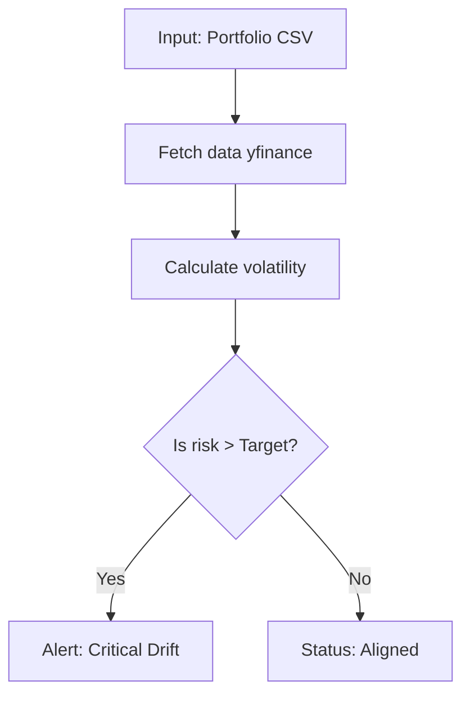

This is a Portfolio Drift and risk alert system that monitors investment portfolios to make sure they stick to intended risk profile. It takes Portfolio holdings as in the assets you own and in what portion and historical returns  or how they have previously have preformed. 

It cleans and validate the data then computes the portfolios current risk and compares it to the target risk profile detecting any drift like when the portfolio moves away from an expected risk range. if drift is significant it raises an alert and provides an explanation of which assets contributed most. 

The output looks something like a risk score a drift indicator and insight into why the portfolio is behaving differently from its plan. the frontend is designed for clarity explainable and real word usability not just raw predictions

