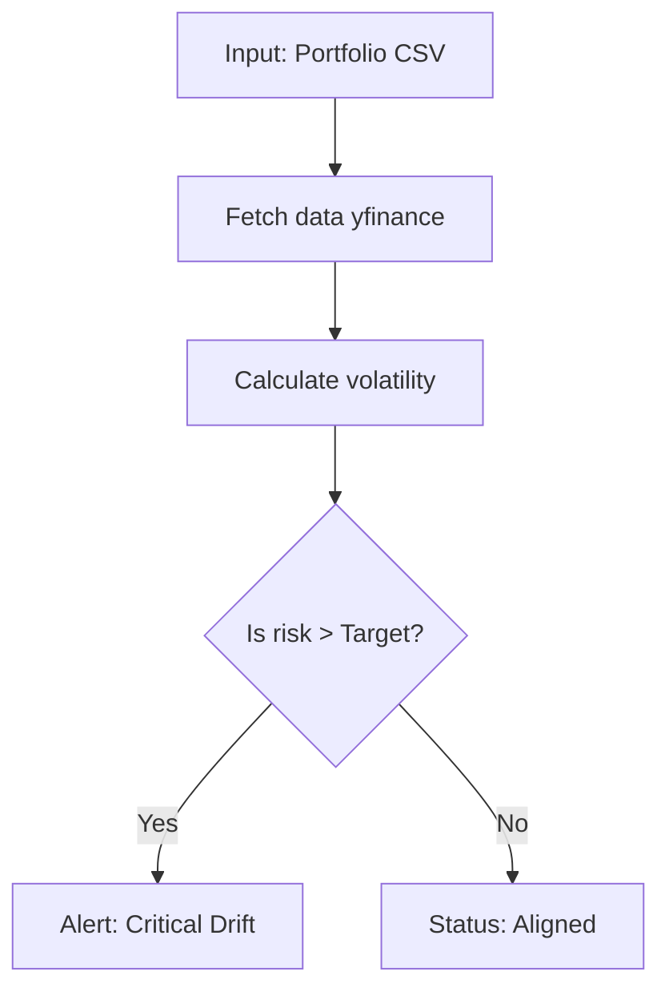

### Portfolio Risk & Drift Alert System
This is a portfolio drift and risk alert system that monitors investment portfolios to ensure they adhere to their intended risk profiles. It ingests your current portfolio holdings (assets and their respective weights) and cross-references them against historical market performance data.

The engine validates the data, computes the portfolio's current volatility, and compares it to a target risk profile to detect drift—the exact moment a portfolio deviates from its expected risk range.

If significant drift is detected, the system calculates a risk score and provides a risk rating (High, Moderate, or Low). The API is designed for clarity, explainability, and real-world usability rather than just outputting raw, unformatted predictions.


 !Important!: Data Input Requirements
To use this engine, you must provide a CSV file of your portfolio. The CSV must contain exactly these two columns:

Ticker: The stock symbol (e.g., AAPL, MSFT)

Weight: The target allocation (can be decimals like 0.5 or percentages like 50).

Example portfolio.csv:


```Ticker,Weight
AAPL, 0.40
MSFT, 0.30
SPY, 0.30
Architecture Flow
```
### Architecture 

### Quick Start (Local Development)
This system is built using Python and FastAPI.

1. Clone the repository and navigate to the directory:

```Bash
git clone https://github.com/Deeads/portfolio-drift.git
cd portfolio-risk-engine
```

2. Install the required dependencies:

```Bash
pip install fastapi uvicorn pandas numpy yfinance python-multipart
```
3. Run the FastAPI Server:
```Bash
uvicorn app.main:app --reload
```
4. Test the API:
Open your browser and navigate to http://127.0.0.1:8000/docs. You will see the auto-generated Swagger UI where you can upload your CSV file and instantly test the /analyze endpoint.